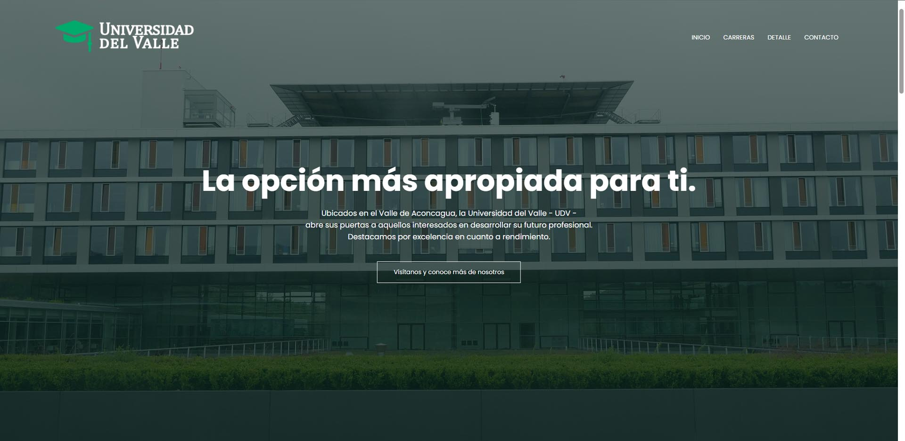

# Universidad del Valle
Página de aterrizaje para un sitio web universitario. HTML, CSS, JS con diseño responsivo.  
Este proyecto ha sido desplegado en GitHub Pages con la siguiente dirección. 
https://fcomontsep.github.io/portafolio-js-landing-uni/

**Para clonar y desarrollar localmente no se requieren instalaciones o pasos extra.**

</a>